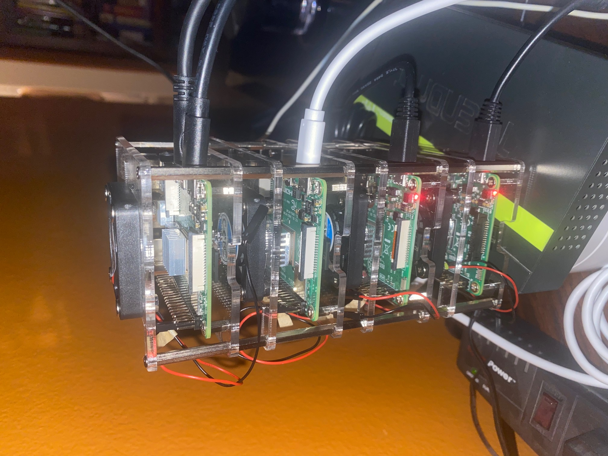

# Creating Home Cluster for Kubernetes
The purpose of this document is to guide users in installing all the necessary software to create a Kubernetes cluster using Raspberry Pi.

This is more like a home based cluster that you can learn on the ins and out Kubernetes. This is by no means complete, but it works well for my purpose of learning kubernetes.

## Hardware Requirements:
These are the hardware that I have used in my home project, your situation might be different from mine. 

* Raspberry Pi 4 8G
* Raspberry Pi 4 4G
* Raspberry Pi 3 2G
* Raspberry Pi 3 2G
* 4 - 64G microSG card



## Networking
	Host		IP Address	
* kmaster - 192.168.1.130
* knode1 - 192.168.1.131
* knode2 - 192.168.1.132
* knode3 - 192.168.1.133

## Operating Systems

For this purpose, I have used a Debian distro variant for Raspberry pi. See below on where and how to write the image to an SD card.

* Download Raspbery Pi Image from here <https://www.raspberrypi.org/blog/raspberry-pi-imager-imaging-utility>
* Download the Debian Raspi Image here: <https://raspi.debian.net/tested-images>. Note the versions of Raspberry Pi image to the hardware you have.
* Run the Raspberry Pi Imager and select "Use Custom"
* Select the image that you have just downloaded (3 or 4)
* Select "Choose SD Card"
* Click on "Write"

I have also tested Ubuntu 20 in the Raspberry pi and also works.

## Booting The First Time
* Insert all the SD cards to each Pi you have
* Connect all the cables (networking, power, HDMI, keyboard). Note that Raspberry Pi 3 and 4 have different HDMI interface. You may have to do this one by one.
* The reason to have an HDMI here is that you can login to the system, change the root password and all other settings
* Login on the prompt using "root" and the username with no password
* Change the root password

```
# passwd
```

## Change Some Settings
First, you need to update the repo cache and install some package

* Update the repository

```
# apt-get update
```

* Install software

```
# apt-get install joe sudo
```
* Change the hostname

```
# joe /etc/hostname
```
change the hostname to <new_name> where the name is one of the host in the "Networking Section"
* Add entry to the hosts file

```
# joe /etc/hosts
```
Add the following lines

   	127.0.0.1 kmaster
    192.168.1.130	 kmaster
    192.168.1.131	 knode1		
    192.168.1.132	 knode2		
    192.168.1.133	 knode3  

Type "CTRL-K-X" to save the file

## Change The IP Address
* Edit /etc/network/interfaces.d/eth0

```
# joe /etc/network/interfaces.d/eth0
  auto eth0
	iface eth0 inet static
	address <New_IP> <==== See networking section
	netmask 255.255.255.0
	network 192.168.1.0
	broadcast 192.168.1.255
	gateway 192.168.1.1  
```

## Create a user and add it to 'sudo' Group

* Add a user

```
# adduser <username>
follow the prompt

add the user to the sudo group
# add user <username> sudo
```

* Create a No-Password entry for the user, so that everytime the user calls 'sudo', it does not ask for a password

```
# joe /etc/sudoers/<username>
Add the following:

<username> ALL=(ALL:ALL) NOPASSWD:ALL
   
```

## Make a password-less entry to all the hosts
* Create a public/private key.
* From your terminal execute:

```
$ ssh-keygen -t rsa -b 2048 -f ~/.ssh/id_rsa
```

* Copy your public key to all nodes

```
$ ssh-copy-id <username>@<IP_ADDRESS>
```

After this, check that you can login to the node without being ask for a password
```
$ ssh <username>@<IP_ADDRESS>
```

## Reboot The System

```
# reboot
```


## Run Ansible 

* $ ansible-playbook debian/01-create-users.yaml -v
* $ ansbile-playbook debian/01-install-packages.yaml -v
* $ ansible-playbook debian/03-cluster-init.yaml -v -k -K (use the sudo password for your host where ansible is running) 
* $ ansible-playbook debian/04-workers-init.yaml -v -k -K

## Copy the Kubernetes Config to your local folder 
* from your localhost where you run ansible, copy the cluster config

```
$ scp <username>@<IP_ADDRESS>:.kube/config <DEST_DIR>/config-raspi
```
where "DEST_DIR" can be "/Users/<username/.kube>" in iMac or "/home/<username>/.kube" in Linux

## Export your new Kubernetes Config
* If you are running another cluster locally, like minikube, its better to have a nother config and you can reload the configuration as you like

```
export KUBECONFIG=/Users/<username>.kube/config-raspi
```

* Run Kubectlk to get cluster information

```
$ kubectl cluster-info
Kubernetes master is running at https://192.168.1.130:6443
KubeDNS is running at https://192.168.1.130:6443/api/v1/namespaces/kube-system/services/kube-dns:dns/proxy
```

## Install Kubernetes Dashboard
I referred to this link https://github.com/kubernetes/dashboard

Execute this to deploy:

```
$ kubectl apply -f https://raw.githubusercontent.com/kubernetes/dashboard/v2.1.0/aio/deploy/recommended.yaml

namespace/kubernetes-dashboard created
serviceaccount/kubernetes-dashboard created
service/kubernetes-dashboard created
secret/kubernetes-dashboard-certs created
secret/kubernetes-dashboard-csrf created
secret/kubernetes-dashboard-key-holder created
configmap/kubernetes-dashboard-settings created
role.rbac.authorization.k8s.io/kubernetes-dashboard created
clusterrole.rbac.authorization.k8s.io/kubernetes-dashboard created
rolebinding.rbac.authorization.k8s.io/kubernetes-dashboard created
clusterrolebinding.rbac.authorization.k8s.io/kubernetes-dashboard created
deployment.apps/kubernetes-dashboard created
service/dashboard-metrics-scraper created
deployment.apps/dashboard-metrics-scraper created
```

## Run a Proxy on your Localhost
You need to run a proxy on your localhost workstation and this will create a secure channel to your kubernetes cluster
 
```
$ kubectl proxy
Starting to serve on 127.0.0.1:8001
```

Now, access the dashboard using

```
http://localhost:8001/api/v1/namespaces/kubernetes-dashboard/services/https:kubernetes-dashboard:/proxy/#/login
```

## Create a Service Account
Add this to a file, say "dashboard-admin.yaml"

Apply this to the cluster

```
$ kubectl apply -f dashboard-admin.yaml
serviceaccount/admin-user created
```

## Get the Bearer Token
Run the following command

```
kubectl -n kubernetes-dashboard get secret $(kubectl -n kubernetes-dashboard get sa/admin-user -o jsonpath="{.secrets[0].name}") -o go-template="{{.data.token | base64decode}}"
```

Copy the token and paste it in the dashboard UI asking for the token

Grant Access if there are any errors

```
$ kubectl apply -f dashboard-grant-access.yaml
clusterrolebinding.rbac.authorization.k8s.io/admin-user created
```

Reload dashboard

## Remove the admin ServiceAccount and ClusterRoleBinding
This account is for testing only, so you may need to remove it now

```
kubectl -n kubernetes-dashboard delete serviceaccount admin-user
kubectl -n kubernetes-dashboard delete clusterrolebinding admin-user
```


